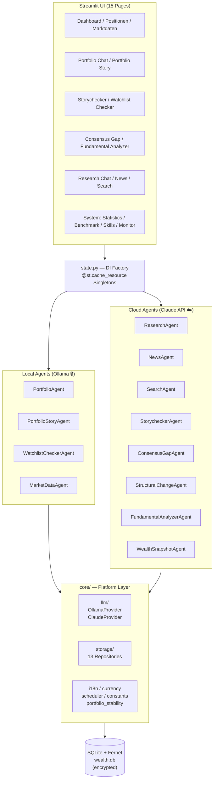
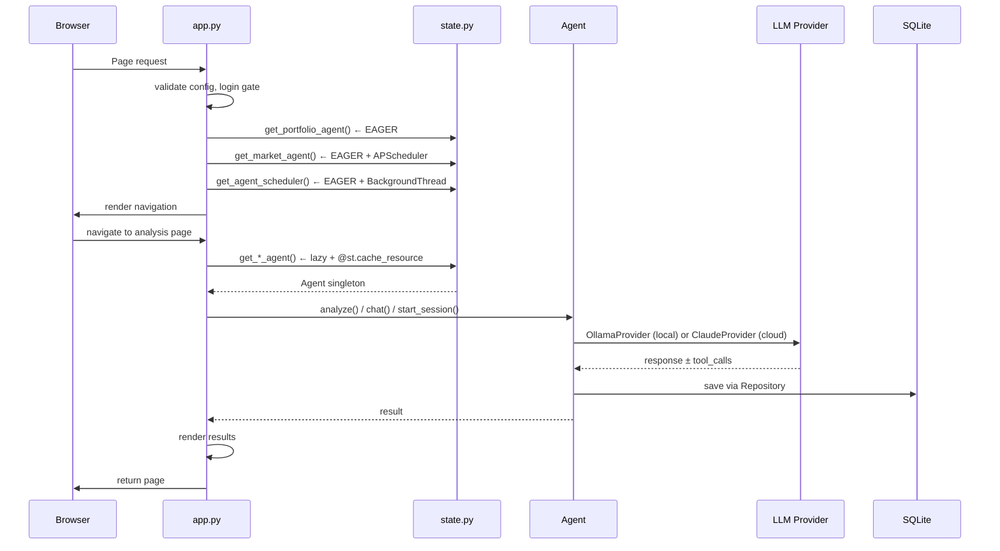

# Architecture Overview

## Software Architecture



## Runtime Architecture



---

## Agent Overview (12 Agents)

| Agent | Provider | Model | Session Type | Primary Method | Scope |
|-------|----------|-------|--------------|--------|-------|
| **PortfolioAgent** | Ollama | Local | Stateless | `chat()` + tools | Portfolio CRUD |
| **PortfolioStoryAgent** | Ollama | Local | Stateless | `analyze()` | Story-fit for portfolio |
| **WatchlistCheckerAgent** | Ollama | Local | Stateless | `check_watchlist()` | Watchlist fit into portfolio |
| **MarketDataAgent** | — | — | Stateless | APScheduler | Price fetch + history |
| **ResearchAgent** | Claude | Haiku | DB-persisted | `start_session()` + `chat()` | Research per position |
| **NewsAgent** | Claude | Haiku | Stateless | `analyze_portfolio()` | News digest |
| **SearchAgent** | Claude | Sonnet | DB-persisted | `start_session()` + `chat()` | Watchlist screening |
| **StorycheckerAgent** | Claude | Haiku | DB-persisted | `start_session()` + `chat()` + `batch_check_all()` | Thesis validation |
| **ConsensusGapAgent** | Claude | Sonnet | Stateless | `analyze_portfolio()` | Market vs. thesis gap |
| **StructuralChangeAgent** | Claude | Sonnet | DB-persisted | `scan()` | Structural shifts |
| **FundamentalAnalyzerAgent** | Claude | Haiku | In-memory | `start_session()` + `chat()` | Deep valuation analysis |
| **WealthSnapshotAgent** | — | — | Stateless | `take_snapshot()` | Portfolio history |

---

## Storage Layer (13 Repositories)

| Repository | Purpose | Tables |
|---|---|---|
| **PositionsRepository** | Portfolio + watchlist positions | `positions` |
| **MarketDataRepository** | Current prices + history | `market_data`, `price_history` |
| **SkillsRepository** | Skill templates per agent area | `skills` |
| **AppConfigRepository** | User settings (models, alerts) | `app_config` |
| **ResearchRepository** | Research chat sessions | `research_sessions`, `research_messages` |
| **SearchRepository** | Investment search sessions | `search_sessions`, `search_messages` |
| **StorycheckerRepository** | Story validation sessions | `storychecker_sessions`, `storychecker_messages` |
| **PositionAnalysesRepository** | Verdicts (storychecker/consensus_gap/fundamental) | `position_analyses` |
| **StructuralScansRepository** | Structural change scan runs | `structural_scan_runs`, `structural_scan_messages` |
| **WealthSnapshotRepository** | Historical portfolio snapshots | `wealth_snapshots` |
| **ScheduledJobsRepository** | Periodic agent runs | `scheduled_jobs` |
| **NewsRepository** | News digest caching | `news_digests` |
| **UsageRepository** | Token counts + costs per call | `usage_log` |

---

## Key Architectural Patterns

### 1. Session-Based Chat
Used by: ResearchAgent, SearchAgent, StorycheckerAgent, StructuralChangeAgent, FundamentalAnalyzerAgent

```python
# Initialize session and persist to repo
session_id = agent.start_session(context=..., skill=...)
# returns int (DB row) or str (UUID)

# Multi-turn conversation
response = agent.chat(session_id, user_message)
# appends to messages table, returns assistant response
```

### 2. Batch Processing (Background Thread)
Used by: ConsensusGapAgent, StorycheckerAgent (batch_check_all), FundamentalAgent

```python
# Track job in session_state
_job = {"running": False, "done": False, "count": 0, "error": None}

# Background thread with asyncio loop
def _run_background(agent, positions, analyses_repo, job):
    loop = asyncio.new_event_loop()
    results = loop.run_until_complete(agent.analyze_portfolio(...))
    job.update({"done": True, "count": len(results)})
    loop.close()

# Polling UI with st.rerun()
if _job["running"]:
    time.sleep(5)
    st.rerun()
```

### 3. Verdict Storage & Retrieval
All verdict agents (Storychecker, ConsensusGap, FundamentalAnalyzer) write to `PositionAnalysesRepository`:

```python
# Store verdict
repo.add(PositionAnalysis(
    position_id=pos.id,
    agent="storychecker",  # or "consensus_gap", "fundamental_analyzer"
    verdict="gemischt",
    summary="...",
    created_at=datetime.now()
))

# Retrieve latest for portfolio
verdicts = repo.get_latest_bulk(position_ids=[...], agent="storychecker")
# returns Dict[position_id, PositionAnalysis]
```

---

## Dependency Injection (state.py)

All agents are **lazy-loaded via `@st.cache_resource` factory functions**. Three agents are **eager-initialized** in `app.py`:

- `get_portfolio_agent()` — Portfolio Chat critical path
- `get_market_agent()` — APScheduler (daily price fetch)
- `get_agent_scheduler()` — Background thread (scheduled cloud jobs)

All others are loaded on first page visit and cached for the session.

Model selection chain:
```
AppConfigRepo.get("model_<provider>_<agent>")  # per-agent override
  OR AppConfigRepo.get("model_<provider>")     # provider-wide override
  OR CLAUDE_HAIKU / CLAUDE_SONNET (constants)  # compile-time default
```

---

## LLM Provider Interface

Both `OllamaProvider` and `ClaudeProvider` extend `LLMProvider` (ABC):

```python
async def chat(messages, max_tokens, temperature) -> str
async def chat_with_tools(messages, tools, ...) -> ProviderResponse

# Shared attributes (set post-construction)
.model: str
.on_usage: Callable  # token callback to UsageRepository
.skill_context: str
.position_count: int
```

**Key Differences:**
- **ClaudeProvider**: Anthropic SDK, system prompt as separate kwarg, rate-limit retry (3x)
- **OllamaProvider**: HTTP client, system prompt inline in messages, single attempt

---

## Configuration Files

### `config/default_skills.yaml`
Skill templates per agent area. Seeded on startup via `SkillsRepository.seed_if_empty()`.

User-editable at runtime. System skills (Josef's Regel) injected directly by agents.

### `config/asset_classes.yaml`
12 asset classes with metadata:
- `name` (Aktie, Aktienfonds, Festgeld, etc.)
- `investment_type` (Wertpapiere, Renten, Geld, etc.)
- `auto_fetch` (enable yfinance)
- `watchlist_eligible` (allow in watchlist)
- `manual_valuation` (show "Schätzwert" button)

---

## Architectural Decisions

### Story-Primacy Model
For existing positions, **Portfolio Story alignment is PRIMARY**. Fundamental/Consensus verdicts are **confirmatory only**.

Rationale: A volatile tech stock is not a "weakness" if the story prioritizes growth — it's exactly what's needed.

### Role-Based Position Fit
Each position has ONE ROLE describing its contribution:
- 🔵 **Wachstumsmotor** — capital growth (ok if volatile)
- 🟡 **Stabilitätsanker** — volatility hedge (bonds, real estate)
- 🟢 **Einkommensquelle** — income generation (dividends)
- 🟣 **Diversifikationselement** — low correlation (gold, commodities)
- 🔴 **Fehlplatzierung** — doesn't fit story

---

## Currency System

**Display-only approach**: `BASE_CURRENCY` env var configurable (EUR/CHF/GBP/USD/JPY). All DB fields remain in EUR.

Pages use `core.currency.symbol()` and `core.currency.fmt()` for display.

---

## Encryption & Storage

- **Prod**: Full encryption via Cryptography/Fernet on: position names, stories, notes, extra_data (JSON)
- **Demo**: Plaintext (PassthroughEncryptionService)
- **Migrations**: Auto-run on startup via `migrate_db()` — idempotent, no data loss

---

## Testing Strategy

- **Unit tests**: Agent logic, repository CRUD, parsing (559 total)
- **Integration tests**: Full workflows with real SQLite (`:memory:`)
- **No mocking of repositories**: Always use real storage for higher fidelity
- **Coverage**: 78.35% (target: 77–80%)

```bash
pytest tests/                 # All
pytest tests/unit/            # Unit only
pytest tests/integration/     # Integration only
pytest -k consensus_gap       # Specific agent
```

---

## Known Technical Debt

See **BACKLOG.md § Technical Debt** for full inventory.

**DEBT Stack Completed (2026-04-16):** ✅
- ✅ [DEBT-9] asyncio.get_event_loop() → asyncio.run() (Python 3.12+ safe)
- ✅ [DEBT-7] state.py decomposed (437 → 60 lines + 5 modules, zero page disruption)
- ✅ [DEBT-4] Service Layer + Agent Encapsulation (AnalysisService, PortfolioService; agents own persistence)

---

## Multi-Language Support (i18n)

**UI Language Selection**: Settings page allows German ↔ English switching via `core.i18n` module.

**Agent Response Language** (2026-04-17):
- Agents accept `language: str = "de"` parameter on execution methods
- System prompts dynamically inject language instruction via `agents/agent_language.py` helpers
- Pages capture `current_language()` in main thread before background thread spawn (session_state safety)

**Verdict Code Preservation**:
- Internal verdict labels (`unterbewertet`, `wächst`, `intact`, etc.) remain German
- These are database identifiers, not user-visible text
- Agents with schema-locked enums use `response_language_with_fixed_codes()` helper
- Explicitly instructs LLM: "Write text in {language}, use EXACTLY these codes as-is"

**Scope**:
- ✅ 7 agents (StorycheckerAgent, ConsensusGapAgent, FundamentalAgent, ResearchAgent, etc.)
- ✅ 6 pages (consensus_gap, fundamental_analyzer, structural_scan, research_chat, storychecker, watchlist_checker)
- ⚠️ **Out of scope**: Page UI labels (agentmonitor.py, portfolio_story.py, positionen.py partially hardcoded German)

---

## Recent Changes (April 2026)

✅ **Agent i18n Support** (2026-04-17)
   - Multi-language responses, verdict codes preserved, thread-safe language passing

✅ **DEBT Stack Complete** (2026-04-16)
   - Async modernization (Python 3.12+), State decomposition, Service layer + Agent encapsulation

✅ Skills Architecture Complete (Phase 5)  
✅ Watchlist Checker + Consensus Gap Analysis Integration  
✅ Fundamental Analyzer (multi-turn session-based)

---

## Service Layer (Post-DEBT-4)

### Core Services

**AnalysisService** (`core/services/analysis_service.py`)
- `get_verdicts(position_ids, agent)` — Fetch verdicts for a list of positions from a specific agent
- `get_all_verdicts(position_ids)` — Fetch all agent verdicts in one call (storychecker, consensus_gap, fundamental_analyzer)
- `get_coverage(positions, agents)` — Count positions missing analysis per agent
- `has_verdict(position_id, agent)` — Check if position has a verdict
- `get_verdict(position_id, agent)` — Get single verdict

**PortfolioService** (`core/services/portfolio_service.py`)
- `get_all_positions(include_portfolio, include_watchlist, require_story, require_ticker)` — Centralized position aggregation
- `get_portfolio_positions()` — Convenience method for portfolio only
- `get_watchlist_positions()` — Convenience method for watchlist only

### Usage Pattern
Pages no longer call `analyses_repo.get_latest_bulk()` or `positions_repo.get_*()` directly:
```python
# Before DEBT-4:
verdicts = analyses_repo.get_latest_bulk(ids, "storychecker")

# After DEBT-4:
verdicts = analysis_service.get_verdicts(ids, "storychecker")
```

### Pages Using Services
- `pages/structural_scan.py` — AnalysisService, PortfolioService
- `pages/positionen.py` — AnalysisService
- `pages/watchlist_checker.py` — AnalysisService, PortfolioService
- `pages/portfolio_story.py` — AnalysisService, PortfolioService
- `pages/consensus_gap.py` — AnalysisService, PortfolioService
- `pages/fundamental_analyzer.py` — PortfolioService  
✅ Portfolio Story subsystem (role-based fit)  
✅ 563+ tests passing, 78.35% coverage  

---

*Last updated: 2026-04-16*
