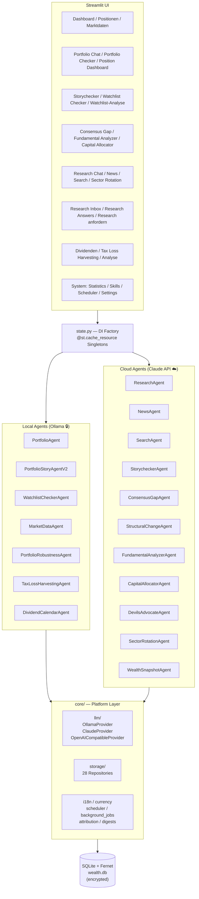
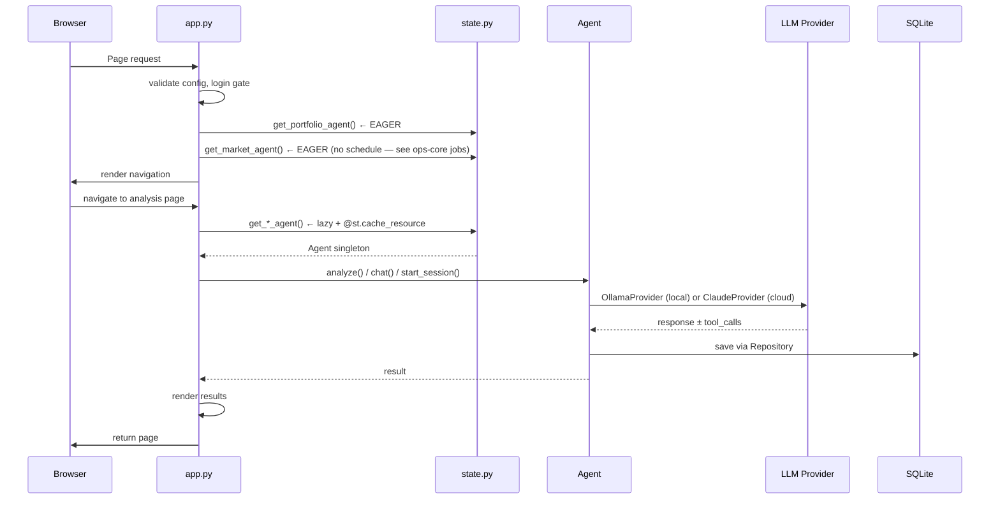
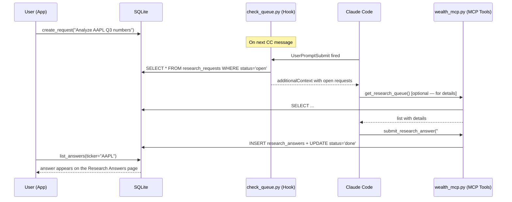

# Architecture Overview

## Software Architecture


```mermaid
graph TD
    subgraph UI["Streamlit UI"]
        PG1["Dashboard / Positionen / Marktdaten"]
        PG2["Portfolio Chat / Portfolio Checker / Position Dashboard"]
        PG3["Storychecker / Watchlist Checker / Watchlist-Analyse"]
        PG4["Consensus Gap / Fundamental Analyzer / Capital Allocator"]
        PG5["Research Chat / News / Search / Sector Rotation"]
        PG6["Research Inbox / Research Answers / Research anfordern"]
        PG7["Dividenden / Tax Loss Harvesting / Analyse"]
        PG8["System: Statistics / Skills / Scheduler / Settings"]
    end

    state["state.py — DI Factory<br/>@st.cache_resource Singletons"]

    subgraph Local["Local Agents (Ollama 🔒)"]
        PA["PortfolioAgent"]
        PSA["PortfolioStoryAgentV2"]
        WCA["WatchlistCheckerAgent"]
        MDA["MarketDataAgent"]
        PRA["PortfolioRobustnessAgent"]
        TLH["TaxLossHarvestingAgent"]
        DCA["DividendCalendarAgent"]
    end

    subgraph Cloud["Cloud Agents (Claude API ☁️)"]
        RA["ResearchAgent"]
        NA["NewsAgent"]
        SA["SearchAgent"]
        SCA["StorycheckerAgent"]
        CGA["ConsensusGapAgent"]
        STA["StructuralChangeAgent"]
        FAA["FundamentalAnalyzerAgent"]
        CAA["CapitalAllocatorAgent"]
        DAA["DevilsAdvocateAgent"]
        SRA["SectorRotationAgent"]
        WSA["WealthSnapshotAgent"]
    end

    subgraph Core["core/ — Platform Layer"]
        LLM["llm/<br/>OllamaProvider<br/>ClaudeProvider<br/>OpenAICompatibleProvider"]
        STOR["storage/<br/>28 Repositories"]
        UTIL["i18n / currency<br/>scheduler / background_jobs<br/>attribution / digests"]
    end

    DB[("SQLite + Fernet<br/>wealth.db<br/>(encrypted)")]

    UI --> state
    state --> Local
    state --> Cloud
    Local --> Core
    Cloud --> Core
    Core --> DB
```

## Runtime Architecture


```mermaid
sequenceDiagram
    participant B as Browser
    participant A as app.py
    participant S as state.py
    participant Ag as Agent
    participant LLM as LLM Provider
    participant DB as SQLite

    B->>A: Page request
    A->>A: validate config, login gate
    A->>S: get_portfolio_agent() ← EAGER
    A->>S: get_market_agent() ← EAGER (no schedule — see ops-core jobs)
    A->>B: render navigation

    B->>A: navigate to analysis page
    A->>S: get_*_agent() ← lazy + @st.cache_resource
    S-->>A: Agent singleton
    A->>Ag: analyze() / chat() / start_session()
    Ag->>LLM: OllamaProvider (local) or ClaudeProvider (cloud)
    LLM-->>Ag: response ± tool_calls
    Ag->>DB: save via Repository
    Ag-->>A: result
    A->>A: render results
    A->>B: return page
```

---

## Agent Overview (18 Agents)

| Agent | Provider | Model¹ | Session Type | Primary Method | Scope |
|-------|----------|-------|--------------|--------|-------|
| **PortfolioAgent** | Ollama | Local | Stateless | `chat()` + tools | Portfolio CRUD |
| **PortfolioStoryAgentV2** | Ollama | Local | Stateless | `analyze()` / `analyze_stability()` / `analyze_story_and_performance()` | Modular portfolio checks (FEAT-18) |
| **WatchlistCheckerAgent** | Ollama | Local | Stateless | `check_watchlist()` | Watchlist fit into portfolio |
| **PortfolioRobustnessAgent** | Ollama | Local | Stateless | `analyze()` | Portfolio-level stress assessment (FEAT-48) |
| **TaxLossHarvestingAgent** | Ollama | Local | Stateless | `analyze()` | Loss positions + tax impact + replacements (FEAT-44) |
| **DividendCalendarAgent** | Ollama | Local | Stateless | `analyze()` | Dividend cashflow commentary (FEAT-45) |
| **MarketDataAgent** | — | — | Stateless | ops-core job `kurse` | Price fetch + history |
| **ResearchAgent** | Claude | Haiku | DB-persisted | `start_session()` + `chat()` | Research per position |
| **NewsAgent** | Claude | Haiku | Stateless | `analyze_portfolio()` | News digest |
| **SearchAgent** | Claude | Sonnet | DB-persisted | `start_session()` + `chat()` | Watchlist screening |
| **StorycheckerAgent** | Claude | Haiku | DB-persisted | `start_session()` + `chat()` + `batch_check_all()` | Thesis validation |
| **ConsensusGapAgent** | Claude | Sonnet | DB-persisted | `analyze_portfolio()` | Market vs. thesis gap |
| **StructuralChangeAgent** | Claude | Sonnet | DB-persisted | `scan()` | Structural shifts |
| **FundamentalAnalyzerAgent** | Claude | Sonnet | DB-persisted | `start_session()` + `chat()` + `analyze_portfolio()` | Deep valuation analysis |
| **CapitalAllocatorAgent** | Claude | Sonnet | DB-persisted | `analyze_portfolio()` | Management capital allocation quality — Watchlist only (FEAT-31) |
| **DevilsAdvocateAgent** | Claude | Sonnet | DB-persisted | `analyze_portfolio()` | Bear case per watchlist position (FEAT-47) |
| **SectorRotationAgent** | Claude | Sonnet | Run-persisted | `scan()` | Sector inflow/outflow vs. portfolio exposure (FEAT-46) |
| **WealthSnapshotAgent** | — | — | Stateless | `take_snapshot()` | Portfolio history |

¹ Compile-time defaults — every agent's model is overridable per agent in Settings (DB) and via `LLM_DEFAULT_MODEL`.

---

## Storage Layer (28 Repositories)

| Repository | Purpose | Tables |
|---|---|---|
| **PositionsRepository** | Portfolio + watchlist positions | `positions` |
| **MarketDataRepository** | Current prices + history | `market_data`, `price_history` |
| **SkillsRepository** | Skill templates per agent area | `skills` |
| **AppConfigRepository** | User settings (models, alerts) | `app_config` |
| **ResearchRepository** | Research chat sessions | `research_sessions`, `research_messages` |
| **SearchRepository** | Investment search sessions | `search_sessions`, `search_messages` |
| **StorycheckerRepository** | Story validation sessions | `storychecker_sessions`, `storychecker_messages` |
| **FundamentalAnalyzerRepository** | Valuation analysis sessions | `fundamental_analyzer_sessions`, `fundamental_analyzer_messages` |
| **ConsensusGapRepository** | Consensus gap sessions | `consensus_gap_sessions`, `consensus_gap_messages` |
| **CapitalAllocatorRepository** | Capital allocator quality sessions | `capital_allocator_sessions`, `capital_allocator_messages` |
| **PositionAnalysesRepository** | Verdicts for all checker agents | `position_analyses` |
| **StructuralScansRepository** | Structural change scan runs | `structural_scan_runs`, `structural_scan_messages` |
| **WealthSnapshotRepository** | Historical portfolio snapshots | `wealth_snapshots` |
| **ScheduledJobsRepository** | Periodic agent runs + run history | `scheduled_jobs`, `scheduled_job_runs` |
| **NewsRepository** | News digest runs + messages | `news_runs`, `news_messages` |
| **UsageRepository** | Token counts + costs per call | `llm_usage`, `usage_resets` |
| **ResearchQueueRepository** | MCP back channel: requests + answers (FEAT-50/52) | `research_requests`, `research_answers` |
| **BatchQueueRepository** | Pending Anthropic Batch API jobs | `pending_batches` |
| **AgentRunsRepository** | Agent run telemetry | `agent_runs` |
| **CoworkRepository** | Research Inbox entries + suggestions | `cowork_research_entries`, `cowork_watchlist_suggestions` |
| **DevilsAdvocateRepository** | Bear case sessions (FEAT-47) | `devils_advocate_sessions`, `devils_advocate_messages` |
| **SectorRotationRepository** | Sector scan runs + verdicts (FEAT-46) | `sector_rotation_runs`, `sector_rotation_messages`, `sector_verdicts` |
| **PortfolioRobustnessRepository** | Portfolio stress analyses (FEAT-48) | `portfolio_robustness_analyses` |
| **PortfolioStoryRepository** | Portfolio story analyses + position fits | `portfolio_story_analyses_new`, `portfolio_story_position_fits` |
| **WatchlistCheckerRepository** | Watchlist checker analyses | `watchlist_checker_analyses` |
| **DividendSnapshotsRepository** | Dividend data + snapshots (FEAT-45) | `dividend_data`, `dividend_snapshots` |
| **MonthlyDigestRepository** | Monthly portfolio digests (FEAT-36) | `monthly_digests` |
| **YearlyDigestRepository** | Yearly portfolio digests (FEAT-37) | `yearly_digests` |

---

## Key Architectural Patterns

### 1. Session-Based Chat
Used by: ResearchAgent, SearchAgent, StorycheckerAgent, StructuralChangeAgent, FundamentalAnalyzerAgent

```python
# Initialize session and persist to repo
session_id = agent.start_session(context=..., skill=...)
# returns int (DB row) or str (UUID)

# Multi-turn conversation
response = agent.chat(session_id, user_message)
# appends to messages table, returns assistant response
```

### 2. Batch Processing (Background Thread)
Used by: ConsensusGapAgent, StorycheckerAgent (batch_check_all), FundamentalAgent

```python
# Track job in session_state
_job = {"running": False, "done": False, "count": 0, "error": None}

# Background thread with asyncio loop
def _run_background(agent, positions, analyses_repo, job):
    loop = asyncio.new_event_loop()
    results = loop.run_until_complete(agent.analyze_portfolio(...))
    job.update({"done": True, "count": len(results)})
    loop.close()

# Polling UI with st.rerun()
if _job["running"]:
    time.sleep(5)
    st.rerun()
```

### 3. Verdict Storage & Retrieval
All verdict agents (Storychecker, ConsensusGap, FundamentalAnalyzer) write to `PositionAnalysesRepository`:

```python
# Store verdict
repo.add(PositionAnalysis(
    position_id=pos.id,
    agent="storychecker",  # or "consensus_gap", "fundamental_analyzer"
    verdict="gemischt",
    summary="...",
    created_at=datetime.now()
))

# Retrieve latest for portfolio
verdicts = repo.get_latest_bulk(position_ids=[...], agent="storychecker")
# returns Dict[position_id, PositionAnalysis]
```

### 4. Session Persistence Pattern (Architektur-Guard)

**Rule**: If an agent supports multi-turn chat (chat history + follow-up messages):
→ Sessions **MUST** be persisted to DB, not stored in-memory `Dict`

**Implementation**: Follow StorycheckerAgent/FundamentalAnalyzerAgent pattern:
1. Create session repository with tables: `<agent>_sessions` + `<agent>_messages`
2. `start_session()` → `repo.create_session()` + `repo.add_message()`
3. `chat()` → `repo.get_messages()` + LLM call + `repo.add_message()`
4. `list_sessions()` → `repo.list_sessions(limit)`

**Why**: In-memory sessions are lost after Streamlit restart. Users lose their chat history and page-load becomes slow with dangling UUIDs. DB persistence solves both.

**Anti-pattern** (don't do this):
```python
# ❌ WRONG: in-memory Dict
class MyAgent:
    def __init__(self):
        self._sessions: Dict[str, MySession] = {}
    
    def start_session(self):
        session_id = str(uuid.uuid4())
        self._sessions[session_id] = MySession(...)  # ← lost after restart
        return session_id
```

---

## Dependency Injection (state.py)

All agents are **lazy-loaded via `@st.cache_resource` factory functions**. Two agents are **eager-initialized** in `app.py`:

- `get_portfolio_agent()` — Portfolio Chat critical path
- `get_market_agent()` — market data for the pages

**No schedule runs in the app.** Everything that runs regularly is an ops-core job (`scripts/job.py`, schedule in `~/.ops-core/jobs.toml`): `agenten` (hourly
and at login — runs the due jobs of the Scheduler page), `kurse` (login and 18:05 — the
daily fetch with history and snapshots) and `kosten` (hourly — real OpenRouter costs).
Streamlit executes `app.py` only when a browser opens the page, and a scheduler in the
app would bypass the house's run log. Frequency and time of an agent job are still set on the Scheduler page;
the job decides what is due (`core.scheduler.ist_faellig`: the most recent scheduled time
has passed and the job has not run since). After three failed scheduled attempts since
that time a job waits for its next one, and `agenten` stays red meanwhile
(`FEHLVERSUCHE_JE_TERMIN`) — otherwise a failing job would retry, and pay, every hour.
The app keeps an `AgentSchedulerService` only
for "run now". Don't add a scheduler to the app again — add a job.

All others are loaded on first page visit and cached for the session.

Model selection chain:
```
AppConfigRepo.get("model_<provider>_<agent>")  # per-agent override
  OR AppConfigRepo.get("model_<provider>")     # provider-wide override
  OR CLAUDE_HAIKU / CLAUDE_SONNET (constants)  # compile-time default
```

---

## LLM Provider Interface

Both `OllamaProvider` and `ClaudeProvider` extend `LLMProvider` (ABC):

```python
async def chat(messages, max_tokens, temperature) -> str
async def chat_with_tools(messages, tools, ...) -> ProviderResponse

# Shared attributes (set post-construction)
.model: str
.on_usage: Callable  # token callback to UsageRepository
.skill_context: str
.position_count: int
```

**Key Differences:**
- **ClaudeProvider**: Anthropic SDK, system prompt as separate kwarg, rate-limit retry (3x)
- **OllamaProvider**: HTTP client, system prompt inline in messages, single attempt

---

## UI Patterns

### Agent Analysis Pages (Unified Design — FEAT-19)

**Storychecker, Consensus Gap, Fundamental Analyzer** follow a consistent pattern:

```
┌─ Help Expander ("Was ist X?")
├─ Batch Section
│  ├─ Only-Pending Checkbox (filter to positions without verdict)
│  ├─ Total/Pending Count (N positions, M pending)
│  ├─ Skill Selector (Consensus Gap, Fundamental)
│  └─ Run All Button (starts background thread)
├─ Divider
└─ 2-Column Layout
   ├─ Left (0.8): Current Results
   │  └─ Card per position (icon, name, verdict, date, summary)
   └─ Right (2.2): Older Tests or Chat
      ├─ Older Tests: Expander per position (limit=5)
      └─ (Chat only in Storychecker/Fundamental)
```

**Batch Processing (Background Thread Pattern):**
- Session state tracks: `running`, `done`, `count`, `errors`, `error`, `last_error`
- Thread calls `agent.analyze_portfolio(positions, skill_name, skill_prompt, language)`
- UI polls every 5s with `st.rerun()` while running
- On done: reload verdicts, show success/error summary, refresh page

**Error Handling:**
- Detailed errors logged to Python logger (level=ERROR)
- User sees safe summary: "❌ Der Batch-Lauf ist fehlgeschlagen. Bitte versuchen Sie es später erneut."
- Last error persisted in session state for debugging

**Verdict Display (with verdict_icon):**
- All agent pages use shared `verdict_icon(verdict, VERDICT_CONFIG)` from `core.ui.verdicts`
- Colors + icons defined per agent in VERDICT_CONFIGS dict
- Older tests shown collapsible per position

### Position-Analysis Agents Pattern (FEAT-22)

**Scope**: Agents that analyze individual portfolio positions and store verdicts: StorycheckerAgent, ConsensusGapAgent, FundamentalAnalyzerAgent.

**Unified Data Model:**
```
position_analyses table:
├─ position_id: which position was analyzed
├─ agent: "storychecker" | "consensus_gap" | "fundamental_analyzer"
├─ verdict: agent-specific enum (e.g., "intact" / "wächst" / "unterbewertet")
├─ summary: 1-sentence summary of verdict
├─ skill_name: which skill was used (optional, for filtering/history)
├─ session_id: reference to agent-specific session table (optional; for multi-turn chat or full-text retrieval)
├─ analysis_text: full analysis details (optional; for agents without sessions, e.g., consensus_gap)
└─ created_at: when analysis was created
```

**Unified UI Pattern** (right-side results panel per position):
```
{verdict_icon} **Position Name**
`Ticker` · Datum · Skill Name

Summary (1 Satz)

▼ Vollständige Analyse [expandable, default open]
  {Retrieved via: session_id → agent_messages table, OR analysis_text field}

▼ Ältere Analysen (N) [expandable, default collapsed]
  {verdict_icon} **Datum** · Skill Name
  Summary
```

**Implementation Checklist for New Position-Analysis Agent:**

1. **Agent Class** (`agents/<name>_agent.py`):
   - `analyze_portfolio(positions, skill_name, skill_prompt, language)` → async batch method
   - Call `analyses_repo.save(position_id, agent=<name>, verdict, summary, [session_id], [analysis_text])`
   - If multi-turn chat needed: create session table + StorycheckerAgent-style repository

2. **Data Storage** (`position_analyses` table):
   - verdict: enum or string; use fixed codes (not localized) for consistency
   - summary: 1 sentence; can be extracted from LLM output or computed
   - session_id (optional): if agent has multi-turn chat, store session reference
   - analysis_text (optional): full response text (if no session table)

3. **Page** (`pages/<name>.py`):
   - Batch section: "Only Pending" checkbox, Skill selector, "Run All" button (background thread)
   - Current Results (right panel):
     ```python
     _verdicts = analyses_repo.get_latest_bulk(position_ids, agent="<name>")
     for _pos, _a in _verdicts.items():
         st.markdown(f"{verdict_icon(_a.verdict)} **{_pos.name}**")
         st.caption(_a.summary)
         # Full-text expander
         if _a.session_id:
             messages = agent.get_messages(_a.session_id)
             with st.expander("▼ Vollständige Analyse", expanded=True):
                 st.markdown(messages[0].content)
         elif _a.analysis_text:
             with st.expander("▼ Vollständige Analyse", expanded=True):
                 st.markdown(_a.analysis_text)
     ```
   - History (inline expander): `analyses_repo.get_for_position(pos_id, limit=20)`
   - **No left-side session navigation** (pages are cleaner when all history is on the right)

4. **Verdict Config** (`core/ui/verdicts.py`):
   - Add `VERDICT_CONFIGS["<agent_name>"]` dict with verdict → (icon, color) mapping

5. **Tests** (`tests/`):
   - Integration test: agent stores verdict + summary correctly
   - Smoke test: page loads without exceptions (`pytest tests/integration/test_db_schema_migration.py`)

---

## Configuration Files

### `config/default_skills.yaml`
Skill templates per agent area. Seeded on startup via `SkillsRepository.seed_if_empty()`.

User-editable at runtime. System skills (Josef's Regel) injected directly by agents.

### `config/asset_classes.yaml`
12 asset classes with metadata:
- `name` (Aktie, Aktienfonds, Festgeld, etc.)
- `investment_type` (Wertpapiere, Renten, Geld, etc.)
- `auto_fetch` (enable yfinance)
- `watchlist_eligible` (allow in watchlist)
- `manual_valuation` (show "Schätzwert" button)

---

## Architectural Decisions

### Story-Primacy Model
For existing positions, **Portfolio Story alignment is PRIMARY**. Fundamental/Consensus verdicts are **confirmatory only**.

Rationale: A volatile tech stock is not a "weakness" if the story prioritizes growth — it's exactly what's needed.

### Role-Based Position Fit
Each position has ONE ROLE describing its contribution:
- 🔵 **Wachstumsmotor** — capital growth (ok if volatile)
- 🟡 **Stabilitätsanker** — volatility hedge (bonds, real estate)
- 🟢 **Einkommensquelle** — income generation (dividends)
- 🟣 **Diversifikationselement** — low correlation (gold, commodities)
- 🔴 **Fehlplatzierung** — doesn't fit story

### Self-Contained Wealth Snapshots
`wealth_snapshots.holdings` (JSON, nullable) stores the full portfolio composition **at
capture time** — per position `{name, ticker, asset_class, quantity, unit, price_eur,
value_eur, annual_dividend_eur, dividend_yield_pct}`. Written by `take_snapshot`.

Rationale: there is **no transaction/holdings history** in the DB (the `positions` table
holds only the current state). Any recompute that uses *current* holdings × *historical*
prices distorts the past whenever the portfolio changed (buys, sells, quantity changes).
Storing each snapshot's own composition makes it self-contained: a date can be re-priced
against its *actual* holdings (`WealthSnapshotAgent._reprice_holdings`), and it is the
foundation for composition-aware analytics (weight/sector drift, per-position dividend
growth, contribution of since-sold positions).

**Limitation — forward-only**: older snapshots have `holdings = NULL`
and cannot be reconstructed accurately. `rebuild_wealth_history` re-prices only
holdings-bearing snapshots and reports legacy ones under `skipped_legacy`; the per-row
🔄 falls back to a current-portfolio approximation (note `recalculated`) for legacy dates.

**Caveat for analytics**: `core/monthly_attribution.py` / `yearly_attribution.py` still
use *current* `quantity` across the period (same distortion class). Migrating them to read
snapshot `holdings` at period boundaries is the natural next step once enough snapshots
have accumulated.

---

## Currency System

**Display-only approach**: `BASE_CURRENCY` env var configurable (EUR/CHF/GBP/USD/JPY). All DB fields remain in EUR.

Pages use `core.currency.symbol()` and `core.currency.fmt()` for display.

---

## Encryption & Storage

- **Prod**: Fernet encrypts five columns of `positions`: `quantity`, `purchase_price`, `notes`,
  `extra_data` (JSON), `story`. **Names, ticker, ISIN and `position_analyses` are plaintext** —
  the encryption protects against losing the file, not against local code. Authoritative:
  `_serialize()` in `core/storage/positions.py` (table in CLAUDE.md).
- **Demo**: Plaintext (PassthroughEncryptionService)
- **Migrations**: Auto-run on startup via `migrate_db()` — idempotent, no data loss

---

## Testing Strategy

- **Unit tests**: Agent logic, repository CRUD, parsing; smoke tests for all pages (AppTest)
- **Integration tests**: Full workflows with real SQLite (`:memory:`)
- **No mocking of repositories**: Always use real storage for higher fidelity
- **Test-first on bugs**: write the failing test before the fix (see CLAUDE.md Test-Disziplin)
- **Coverage** must stay at 50%+ (`pytest.ini`); the suite runs in about a minute

```bash
pytest tests/                 # All
pytest tests/unit/            # Unit only
pytest tests/integration/     # Integration only
pytest -k consensus_gap       # Specific agent
```

---

## Multi-Language Support (i18n)

**UI Language Selection**: Settings page allows German ↔ English switching via `core.i18n` module.

**Agent Response Language**:
- Agents accept `language: str = "de"` parameter on execution methods
- System prompts dynamically inject language instruction via `agents/agent_language.py` helpers
- Pages capture `current_language()` in main thread before background thread spawn (session_state safety)

**Verdict Code Preservation**:
- Internal verdict labels (`unterbewertet`, `wächst`, `intact`, etc.) remain German
- These are database identifiers, not user-visible text
- Agents with schema-locked enums use `response_language_with_fixed_codes()` helper
- Explicitly instructs LLM: "Write text in {language}, use EXACTLY these codes as-is"

**Scope**:
- ✅ All analysis agents accept `language` (StorycheckerAgent, ConsensusGapAgent, FundamentalAnalyzerAgent, ResearchAgent, DevilsAdvocateAgent, …)
- ✅ Page UI via `translations/de.yaml` + `en.yaml` (`core.i18n.t()`) — most pages fully covered
- ⚠️ **Known debt**: portfolio_story.py and positionen.py partially hardcoded German; cowork_setup.py intentionally German-only until FEAT-56

---

## Service Layer

### Core Services

**AnalysisService** (`core/services/analysis_service.py`)
- `get_verdicts(position_ids, agent)` — Fetch verdicts for a list of positions from a specific agent
- `get_all_verdicts(position_ids)` — Fetch all agent verdicts in one call (storychecker, consensus_gap, fundamental_analyzer)
- `get_coverage(positions, agents)` — Count positions missing analysis per agent
- `has_verdict(position_id, agent)` — Check if position has a verdict
- `get_verdict(position_id, agent)` — Get single verdict

**PortfolioService** (`core/services/portfolio_service.py`)
- `get_all_positions(include_portfolio, include_watchlist, require_story, require_ticker)` — Centralized position aggregation
- `get_portfolio_positions()` — Convenience method for portfolio only
- `get_watchlist_positions()` — Convenience method for watchlist only

### Usage Pattern
Pages do not call `analyses_repo.get_latest_bulk()` or `positions_repo.get_*()` directly:
```python
verdicts = analysis_service.get_verdicts(ids, "storychecker")
```

### Pages Using Services
- `pages/structural_scan.py` — AnalysisService, PortfolioService
- `pages/positionen.py` — AnalysisService
- `pages/watchlist_checker.py` — AnalysisService, PortfolioService
- `pages/portfolio_story.py` — AnalysisService, PortfolioService
- `pages/consensus_gap.py` — AnalysisService, PortfolioService
- `pages/fundamental_analyzer.py` — PortfolioService

---

## Household LLM Accounting

All apps on this machine talk to the same providers (Claude, Ollama, OpenRouter). Every call
is booked into the shared run log of **ops-core** (in the `heimnetzwerk` repo), where the
Maschinenraum sums the running calendar month per provider and holds it against a budget.

**Where it hooks in.** `UsageRepository.record()` — the one choke point
every call already passes through — writes the usage row and then books
a `metric` event via `core/ops_events.py`. No call site changed.

**What a booking carries.** Provider, model, the agent as `purpose`,
token counts, cost, duration; for OpenRouter also the `generation_id`.
No positions, no names, no prompt text — and the log is a file on this
machine, in the same house as the app.

**Two prices, one call.** The booking carries the **list price**, priced
from the same model registry the statistics page uses. When the cost sync
later learns what OpenRouter actually billed (`/generation`),
`update_actual_cost()` books the **difference** as a separate metric
(`llm_call_cost`). The household sum settles on the billed amount without
the call ever being counted twice, and a second sync of the same row
books nothing.

**Pricing normalisation.** The registry holds Haiku under its dated id
while the API also accepts the dateless alias; `_estimate()` falls back
to the base id (the rule `core.llm.router` already applies to the model
picker), so a call is not silently booked at 0 just because it used the
other form. Note this fallback is **not** applied to the statistics page:
a historic row under an id the registry does not hold still shows 0
there.

**Two rules inherited from ops-core**, both enforced by tests: a call
must never fail because the log is unwritable (every error swallowed,
noted on stderr), and the contract is the file, not the code — the writer
is a deliberate copy, no import, so nothing here depends on ops-core
being installed. Without `~/.ops-core` nothing is booked and nothing is
created; the test suite points `OPS_CORE_HOME` at a throwaway directory.

## Running on the Home Server

The app runs on the household Mac mini next to the other systems of the house.
Everything that ties them together lives in the `heimnetzwerk` repo, not
here; this repo only delivers the pieces the house asks for:

| Piece | Here | Wired up in `heimnetzwerk` |
|---|---|---|
| The app | `streamlit run app.py`, `127.0.0.1:8655` under `/wealth/` (`.streamlit/config.toml`) | `ops-core.wealth_management.app` (KeepAlive) from `~/.ops-core/jobs.toml`; Caddy route with `zugang = "lokal"` — reachable only from the Mini itself (`http://localhost/wealth/`), 404 for every other sender |
| The schedule | `scripts/job.py agenten / kurse / kosten`: the due jobs of the Scheduler page, the daily fetch, OpenRouter costs | jobs `agenten` (login, :05), `kurse` (login, 18:05), `kosten` (login, :35); run log, `ops status` and the jobs tile like every job; the tile's Wealth row jumps to `/wealth/scheduler` |
| The tile | `scripts/kachel.py --fetch` writes `~/.dienste/www/kacheln/wealth.json`: day change, positions, biggest mover | job `kachel`, hourly at :40 and at login |
| The notice | `core/story_meldung.py`: once the Story Checker has judged every position with a story, the tile carries the sum of its verdicts, red if one is endangered, linking to `/wealth/storychecker` | written by the tile job — never when the tile is opened |
| The ✕ on the notice | `scripts/meldungen_dienst.py`, stdlib only, `127.0.0.1:8656`; a POST remembers the dismissed pass in `app_config` and drops the notice from the file | service `meldungen`; Caddy routes `/kacheln/wealth/*` there (it must sit under the tile's path, or the start page shows no ✕) |
| LLM accounting | `core/ops_events.py` (see above) | read back by the Maschinenraum |
| House model | model name `home` → `core/house_models.py`, resolved in `core.llm.router.resolve_house_model` at call time; `batch` and `effort` from the same file | `~/.ops-core/modelle.toml`, edited in the Maschinenraum |
| Batch | scheduled runs go as an Anthropic batch when the household switch is on (`_BATCH_ERLAUBT`): half price, same effort/max_tokens as live, booked with `source="batch"`; the `agenten` job reports `wartet` to the run log. "Run now" stays live | switch in the Maschinenraum; see `docs/haus/integrationen.md` (Claude) |
| Process diagrams | `deploy/n8n/ablaeufe/`: portfolio-check and watchlist-check, never run; `tests/unit/test_prozessbilder.py` checks the named code | imported with `deploy/ops-core/n8n-ablaeufe.sh` |

Two rules carry over from the house. **Nothing on the start page is
computed when it is opened** — the hourly job decides, the page reads a
file. And **no app imports another**: the contracts are files
(`jobs.toml`, the run log, the tile JSON) and HTTP. Wealth Management is
deliberately *not* in the house's nightly iCloud backup — it keeps its
own restic backup to an external drive (`~/scripts/wm_backup.sh`, outside
the repo, run by hand via `ops run wealth_management backup`).

---

## LLM Provider Configuration

The public LLM layer is provider-agnostic and configured via environment variables.

### Configuration Variables

| Variable | Purpose | Default |
|---|---|---|
| `LLM_API_KEY` | Provider API key | — (required) |
| `LLM_BASE_URL` | Endpoint URL | empty = Anthropic direct |
| `LLM_DEFAULT_MODEL` | Fallback model when no DB override exists | empty = `claude-haiku-4-5-20251001` |
| `CLAUDE_MODELS` | Comma-separated list for the Settings dropdown | `claude-haiku-4-5-20251001,claude-sonnet-5,claude-opus-5` |

### Model Resolution Chain

```
DB (agent-specific)
  → DB (global)
  → LLM_DEFAULT_MODEL (if set)
  → hardcoded constant (CLAUDE_HAIKU/CLAUDE_SONNET)
```

DB entries are written via the Settings UI. `LLM_DEFAULT_MODEL` serves as a fallback for infrastructure changes (provider switch without reconfiguring Settings).

### Settings Dropdown — Availability Filter

`CLAUDE_MODELS` is the **allowlist**, `client.models.list()` only the availability check: a
configured model that the key cannot see (corporate proxy, restricted model) drops out of the
dropdown; dated IDs and their undated aliases count as the same model. If the API call returns
nothing, the configured list stands (no empty dropdown). A saved model that is no longer listed
stays visible and selected — silently falling back to option 0 would show one model while the
agent keeps running another.

### Model Prices and the `claude_legacy` Provider

`compute_cost()` looks prices up in the registry only (`app_config.model_prices`, seeded from
`core/storage/app_config.py` defaults — stored values win over defaults). Removing a retired model
ID would therefore silently re-cost its historical `llm_usage` rows at $0. Retired Claude models
keep their price of the day under the provider `claude_legacy`, which is **not** in
`PUBLIC_PROVIDERS`: out of the model selection, still in the cost calculation.

### Web Search

| Mode | Condition | Portability |
|---|---|---|
| Anthropic built-in (`web_search_20250305`) | no `TAVILY_API_KEY` | Anthropic / OpenRouter only |
| Tavily (client-side) | `TAVILY_API_KEY` set | any provider with tool use |

The agents name the search with dynamic filtering (`WEB_SEARCH_TYPE` =
`web_search_20260209` in `core/constants.py`): Claude filters the results in code before they
enter the context — fewer input tokens per search. It runs via code execution, which Haiku 4.5
lacks; `tools_for_model()` in `core/llm/claude.py` swaps in the basic `web_search_20250305` for
Haiku, live and in the batch. A long search turn may come back as `pause_turn`; `chat_with_tools`
continues it up to `MAX_PAUSE_CONTINUATIONS` times. In a batch there is no continuing — such a
position stays "ohne Ergebnis" like a missing verdict.

Client tools (verdicts, watchlist proposals) are `strict: true` with `additionalProperties: false`:
when the model calls one, the arguments match the schema. It does **not** guarantee the call
itself — `tool_choice` `tool`/`any` is gone on Opus/Sonnet 5.5. Structured outputs
(`output_config.format`) would, but the API rejects them together with web search (search
results carry citations). Behind a proxy `strict` is stripped, as the proxy path predates it.

Agents with web search (SearchAgent, StructuralChangeAgent, NewsAgent): on OpenRouter or other providers, enable via Tavily — or pick models with built-in search (Perplexity Sonar).

### Known Provider Configurations

#### Anthropic direct (default)
```env
LLM_API_KEY=sk-ant-...
# LLM_BASE_URL, LLM_DEFAULT_MODEL = empty
```

#### OpenRouter  
*Anthropic-SDK-compatible, 100+ models (Claude, GPT-4o, Perplexity Sonar, etc.)*

```env
LLM_API_KEY=sk-or-...
LLM_BASE_URL=https://openrouter.ai/api/v1
LLM_DEFAULT_MODEL=anthropic/claude-sonnet-5
CLAUDE_MODELS=anthropic/claude-haiku-4-5-20251001,anthropic/claude-sonnet-5,perplexity/sonar,openai/gpt-4o
TAVILY_API_KEY=tvly-...  # optional: web search for GPT-4o, etc.
```

**Perplexity Sonar via OpenRouter:** Sonar has built-in web search — no separate web-search tool calls needed. Select Sonar in Settings → no Tavily required.

#### Perplexity Sonar direct  
*OpenAI API format, built-in web search, no tools needed*

```env
OPENAI_API_KEY=pplx-...
OPENAI_BASE_URL=https://api.perplexity.ai
OPENAI_MODELS=sonar,sonar-pro,sonar-reasoning
```

**Note:** With Sonar the `OpenAICompatibleProvider` is used (not ClaudeProvider). Sonar has internal web search → agents work without Tavily/tool-use loop. Ideal for "out of Anthropic tokens" scenarios.

#### Other compatible endpoints (OpenAI format)
Any endpoint supporting the OpenAI API format uses `OpenAICompatibleProvider`:
- **Groq**: `OPENAI_BASE_URL=https://api.groq.com/openai/v1`
- **Together AI**: `OPENAI_BASE_URL=https://api.together.xyz/v1`
- any OpenAI-compatible proxy

**Important after a provider switch:**  
1. Set `OPENAI_MODELS` (or `CLAUDE_MODELS` for Anthropic-compatible providers) to the new model IDs
2. Open the Settings page → re-select models for each agent (writes to DB)
3. DB entries then override all fallbacks

### Provider Switch Workflow (example: Anthropic → Sonar)

```bash
# 1. Adjust .env (no need to change LLM_API_KEY — keep it for the OpenRouter scenario)
OPENAI_API_KEY=pplx-...
OPENAI_BASE_URL=https://api.perplexity.ai
OPENAI_MODELS=sonar,sonar-pro

# 2. Start the app
streamlit run app.py

# 3. Settings → Cloud Agents (now shows "OpenAI-compatible 🌐" instead of "Claude ☁️")
# → set models for News, Search, etc. to "sonar" → Save

# 4. Run an agent → automatically uses Sonar with built-in web search
```

---

## MCP Server Architecture (FEAT-49/50/51/52)

### What is MCP?

The **Model Context Protocol** (MCP) is an open protocol by Anthropic that connects LLM hosts (e.g. Claude Code, Claude Desktop) to external tool servers. The transport is JSON-RPC 2.0 over stdio — no HTTP server, no port, no auth setup.

```
Claude Code  ──stdio──►  MCP Server (wealth_mcp.py)
             ◄──stdio──   FastMCP SDK → tool functions (Python)
```

The server declares tools as plain Python functions with `@mcp.tool()`. Claude Code discovers them at startup, lists them as available tools, and calls them like any other tool call.

### Dual-Venv Architecture

The MCP server runs in its own virtual environment, so the MCP SDK and its dependencies stay
out of the app's.

```
.venv/        — main app, all tests, all imports
mcp_venv/     — only mcp_server/wealth_mcp.py
```

The separation is clean: `mcp_server/_helpers.py` contains the testable logic (no MCP import) — YAML building, atomic file writes, input validation (`validate_answer_input`), and the `BearerTokenMiddleware` — importable from `.venv`. `wealth_mcp.py` imports `_helpers` + FastMCP and runs only in `mcp_venv`.

```
mcp_server/
├── _helpers.py       # no MCP import — testable from .venv (incl. auth middleware + validation)
├── wealth_mcp.py     # FastMCP server — runs in mcp_venv
├── check_queue.py    # hook script — /usr/bin/python3
├── requirements.txt  # mcp[cli]>=1.0.0, pyyaml>=6.0, uvicorn
└── __init__.py
```

### Registration and Auto-Approval

```json
// .mcp.json (project root — loaded at Claude Code startup)
{
  "mcpServers": {
    "wealth-research": {
      "command": "/Users/erik/Projects/wealth_management/mcp_venv/bin/python",
      "args": ["-m", "mcp_server.wealth_mcp"],
      "cwd": "/Users/erik/Projects/wealth_management"
    }
  }
}
```

```json
// .claude/settings.json
{
  "enabledMcpjsonServers": ["wealth-research"]
}
```

`enabledMcpjsonServers` suppresses the manual approval prompt on every session start.

### Tool Overview

| Tool | Direction | What it does |
|---|---|---|
| `propose_position()` | Claude → App | Writes `.md` to the Cowork outbox, file watcher imports it |
| `propose_multiple()` | Claude → App | Batch version, several candidates in one file |
| `get_research_queue()` | Claude ← App | Reads open research requests from `research_requests` |
| `complete_research_request(id)` | Claude → App | Marks a request as done |
| `submit_research_answer(md, ...)` | Claude → App | Writes an answer to `research_answers`, marks the request done |

### Bidirectional Communication (FEAT-50/51)

The research queue implements two complementary channels:

```
App → Claude:  research_requests table  +  UserPromptSubmit hook
Claude → App:  research_answers table   +  submit_research_answer() tool
```

**App → Claude (posting requests):**
1. User fills in the form on the Position Dashboard page (or the global Research Request page)
2. `ResearchQueueRepository.create_request()` writes a row to the DB
3. `mcp_server/check_queue.py` runs before every Claude Code message (hook)
4. The hook reads open requests and injects them as `additionalContext`
5. Claude sees the requests at the start of every session/message

**Claude → App (answering requests):**
1. Claude calls `get_research_queue()` for details
2. Answers via `submit_research_answer(markdown, request_id)` 
3. The answer appears in `pages/research_answers.py` under "Answers"
4. The request is automatically marked `done`


```mermaid
sequenceDiagram
    participant U as User (App)
    participant DB as SQLite
    participant H as check_queue.py (Hook)
    participant CC as Claude Code
    participant T as wealth_mcp.py (MCP Tools)

    U->>DB: create_request("Analyze AAPL Q3 numbers")
    Note over H: On next CC message
    CC->>H: UserPromptSubmit fired
    H->>DB: SELECT * FROM research_requests WHERE status='open'
    H-->>CC: additionalContext with open requests
    CC->>T: get_research_queue() [optional — for details]
    T->>DB: SELECT ...
    T-->>CC: list with details
    CC->>T: submit_research_answer("## AAPL Q3...", request_id=1)
    T->>DB: INSERT research_answers + UPDATE status='done'
    U->>DB: list_answers(ticker="AAPL")
    DB-->>U: answer appears on the Research Answers page
```

### UserPromptSubmit Hook

```python
# mcp_server/check_queue.py — output format
output = {
    "hookSpecificOutput": {
        "hookEventName": "UserPromptSubmit",
        "additionalContext": "📋 2 open requests...",
    }
}
print(json.dumps(output))
```

`additionalContext` is injected into the context before the user message — Claude sees the requests automatically, without the user doing anything.

### Cowork Outbox Pattern (FEAT-49)

`propose_position()` writes `.md` files atomically into the outbox directory:

```python
# Atomic write: tmp/ → rename (prevents partial file reads by the watcher)
tmp_path.write_text(content, encoding="utf-8")
tmp_path.rename(final_path)  # atomic on same filesystem
```

The app's existing watchdog file watcher detects new files and imports them as watchlist candidates for human review — with zero code changes to the app.

### Security Hardening (SEC-4 + SEC-5)

The MCP server is the first external write path that does not go through the Streamlit UI. Mitigations:

| Vector | Mitigation |
|---|---|
| Path traversal in outbox filename | Slug sanitization (`[^A-Za-z0-9._-]` → `_`) + date prefix |
| Prompt injection via hook context | XML framing **and** escaping (`xml.sax.saxutils`) — tag breakout from `focus`/`ticker` impossible, output is parseable XML |
| Oversize inputs | `focus` ≤ 500, `context` ≤ 2000, `ticker` ≤ 20 chars, `answer_md` ≤ 100 KB |
| Duplicate write paths (repo vs. raw SQL) | Limits defined in `core/storage/research_queue.py` **and** `mcp_server/_helpers.py`; a test enforces they stay in sync |
| HTTP transport auth | Bearer token required, `hmac.compare_digest` (constant-time), websocket scope rejected, bound to `127.0.0.1` |
| DB access | Convention + checklist (CLAUDE.md): tools touch only `research_requests`/`research_answers` |

### Storage Tables

```sql
CREATE TABLE research_requests (
    id           INTEGER PRIMARY KEY AUTOINCREMENT,
    request_type TEXT NOT NULL DEFAULT 'research_question',  -- watchlist_candidate | research_question | analysis_deepdive | general
    ticker       TEXT,
    focus        TEXT NOT NULL,   -- the actual question/request
    context      TEXT,            -- additional context (optional)
    source       TEXT NOT NULL DEFAULT 'manual',  -- manual | agent | batch
    status       TEXT NOT NULL DEFAULT 'open',    -- open | in_progress | done
    created_at   TEXT NOT NULL DEFAULT (datetime('now')),
    updated_at   TEXT NOT NULL DEFAULT (datetime('now'))
);

CREATE TABLE research_answers (
    id         INTEGER PRIMARY KEY AUTOINCREMENT,
    request_id INTEGER REFERENCES research_requests(id),
    ticker     TEXT,
    answer_md  TEXT NOT NULL,
    created_at TEXT NOT NULL DEFAULT (datetime('now'))
);
```

